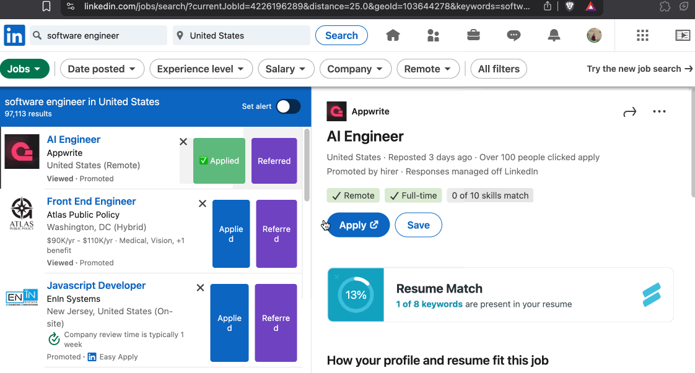

# 🔖 LinkedIn Job Tracker :- Chrome Extension

Track your LinkedIn job applications directly while browsing. Mark jobs as **Applied** or **Referred**, and view or export your job history, all in a simple, privacy-first Chrome Extension.



---

## ✨ Features

✅ Add “Applied” / “Referred” tags to any job post on LinkedIn  
📋 View all tracked jobs in a popup  
📅 Stores job title, company, status, and timestamp  
⬇️ Export your job tracking history as a CSV file  
💾 Everything stored locally using `chrome.storage.local`  
🚫 No login. No backend. No tracking.

---

## 🛠️ Tech Stack

- Manifest V3
- JavaScript (Vanilla)
- `chrome.storage.local`
- MutationObserver
- HTML/CSS
- CSV Blob export

---

## 🚀 How It Works

1. Injects “Applied” / “Referred” buttons into LinkedIn job cards.
2. Tracks and stores metadata locally.
3. Displays your application history in a popup.
4. Lets you download all tracked jobs as a CSV.

---

## 🐞 CSP Fix (Inline Script Block)

This extension uses **Manifest V3**, which blocks inline scripts.  
✅ JavaScript for the popup is loaded via an external `popup.js` file to comply with CSP.

---

## 📦 Installation

1. Clone this repo:
   ```bash
   git clone https://github.com/your-username/linkedin-job-tracker-extension.git

2. Go to chrome://extensions

3. Enable Developer Mode

4. Click Load unpacked

## Now visit LinkedIn Jobs, and start tracking!
